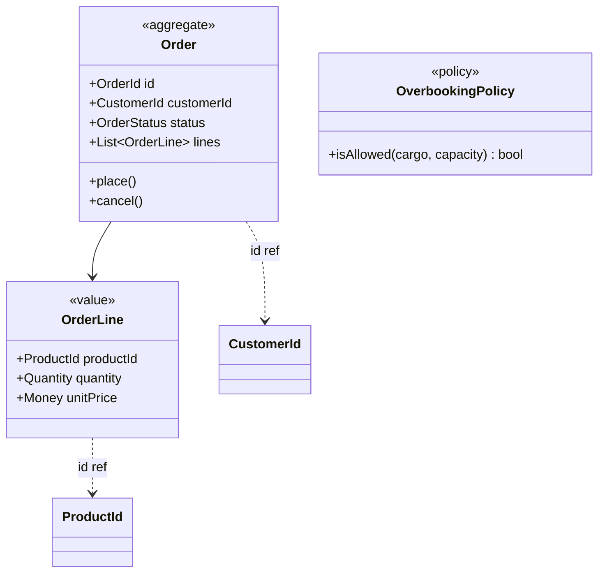
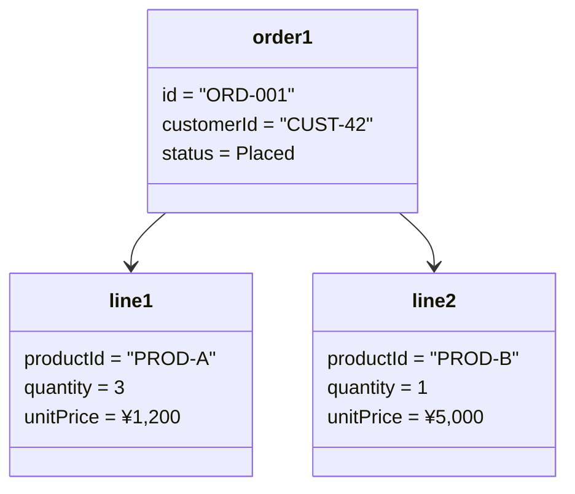

# ドメインモデリング

新しい機能（概念）を追加する際に、ドメインモデルの**検知・判断・構築・検証**を一貫して行うスキル。

関連: `robust-code.md`（型による予防的設計、完全性）、`authorization.md`（認可設計。Specification の認可応用、DDD Trilemma との関係）

---

## ユビキタス言語: 言語としてのドメインモデル

ユビキタス言語の設計はドメインモデリングそのもの。「同じ言葉を使う」だけでは足りない。語彙・構造・意味・文脈の**四層**を揃えて初めて言語として機能する。

### 言語の四層構造

| 層 | 言語学的意味 | ドメインモデルでの対応 |
|----|------------|-------------------|
| lexicon（語彙） | ドメインの名詞と動詞 | 概念と操作の名前 |
| syntax（統語） | 語の組み合わせ規則 | 概念の構成（複合・分岐・任意） |
| semantics（意味） | 語や文が指すもの | 不変条件、事前/事後条件、状態遷移 |
| pragmatics（語用） | 文脈による意味の変化 | Bounded Context による文脈の切り分け |

**用語集とユビキタス言語の違い**: 用語集は lexicon のみを記載した成果物。syntax / semantics / pragmatics が暗黙のまま放置される。**semantics（振る舞いによる意味の定義）が用語集と言語の分かれ目**。behavior によってはじめて「語がどう使われるか」が定義される。

> 日本語訳「同じ言葉」は lexicon の層しか含意せず、syntax / semantics / pragmatics の3層が抜け落ちる。本来のユビキタス言語は**意味と文脈まで一致させる**概念。

### 言語をコードに埋め込む

ユビキタス言語は静的ドキュメント（用語集）として保持するのではなく、コードと並行進化させる:

- **代数的データ型として記述**（Scott Wlaschin / F# Domain Modeling Made Functional）: types そのものがユビキタス言語になる。可能な状態のみ表現可能にする
- **Always-Valid Model**: 不変条件をコンストラクタで強制し、ありえない状態を型で排除（`robust-code.md` の Parse, don't Validate と同じ思想）
- **アノテーション → 用語集自動生成**（Cyrille Martraire / Living Documentation）: コード側のアノテーションから最新の用語集を派生させ、コードと用語集の乖離を構造的に防ぐ
- **形式性のある仕様**（Dan North / BDD）: 仕様自体がドメインモデルを作り、ユビキタス言語の syntax / semantics を担う

---

## 検知: モデリングが必要なサイン

### コンテキスト境界の兆候（言語ゲーム）

同じ言葉でも**アクターの目的が異なれば意味とルールが変わる**。この兆候があれば、コンテキスト分割（=モデル新規作成）が必要。

- 同じ用語がアクターごとに異なる意味で使われている
- 1つの型に異なるアクターのルールが混在している
- 新機能の追加先が「どのアクターの目的か」で迷う

### 言語の崩壊サイン（ユビキタス言語が用語集化している）

ユビキタス言語が「用語集」レベルに退化すると、以下のサインが現れる。`§ ユビキタス言語: 言語としてのドメインモデル` の四層構造で、lexicon 以外の層が機能していない状態。

- **翻訳の蓄積**: ドメイン専門家と開発者の語りの差を場面ごとに翻訳し続けている → 言語が分離していて semantics が共有されていない
- **動詞の欠如**: 用語集が名詞ばかりで振る舞い（動詞）が現れない → behavior が言語の semantics 層を作る。動詞なしでは意味が定義できない
- **コードと用語集の乖離**: 用語集が静的ドキュメントとして放置され、コードの type / 関数名と並行進化していない
- **瞬間的表現の喪失**: ドメイン理解の核心は発話の場で瞬間的に現れる。会議の場で生まれた言い回しが用語集に残らず消えていく

### 再構築の兆候（脱構築）

既存モデルに以下のコードの匂いがあれば、再構築が必要。

- **Fat Model**: プロパティが増え続け、肥大化している
- **boolean フラグで状態管理**: `isApproved`, `isCancelled`, `isShipped` が混在
- **スタンプ結合**: メソッドがオブジェクト全体を受け取るが一部しか使わない
- **Shotgun Parsing**: 同じバリデーション（`if (x != null)`）が複数箇所に散在 → モデルが Always-Valid でない
- **名前と振る舞いの乖離**: 型名が実態を表していない、曖昧な `XxxService`
- **命名の複文化**: メソッド名を正確に書くと「A の場合は〜し、B の場合は〜する」になる
- **状態による不変条件の変化**: ステータスごとに必須項目や可能な操作が異なる

### 検知を妨げるバイアス

- **物理エンティティバイアス**: 目に見えるモノに引っ張られ、全属性を1クラスに詰め込む
- **技術スキーマ**: すべてを CRUD / DB テーブルで解決しようとする
- **言葉の無意識な翻訳**: ドメインエキスパートの言葉を自分の知識に置き換えてしまう
- **正常系バイアス**: 正常系に集中し、異常系の制約を後回しの if 文で対処 → 制約自体がドメイン概念（Policy/Specification）であることを見落とす

> **「違和感」はバイアスのズレを示すサイン。** 聞き慣れない言葉、使い方の違いを感じたら、わかったつもりにならず確認する。

---

## 判断: 新規作成 or 再構築

### 新規作成

- 既存モデルに該当する概念がない
- 既存の型に追加すると**アクターの目的が混在**する
- 新しい不変条件が既存型の不変条件と矛盾する
- **ライフサイクルの段階で関心事が変わる**（例: 書籍の執筆→マーケ→出荷で必要な振る舞いが全く異なる）

### 再構築

- 上記「再構築の兆候」に該当する
- 新概念の追加が既存モデルの**直交性を壊す**（1変更が複数仕様に波及する）

### よくある誤り

- **DRY の誤適用 / 統一モデル志向**: 同じ名前・似たコードだからと異なるコンテキストの概念を統合 → 神クラス化。DRY はコードの重複ではなく**ビジネス知識の重複**を防ぐ原則
- **過剰分割**: 同じユビキタス言語の凝集性の高いロジックを分けすぎ → 1変更に複数コンテキストの修正が必要になる
- **lexicon だけのユビキタス言語**: 用語集を作って完了とする。syntax（構成）/ semantics（不変条件・状態遷移）/ pragmatics（Bounded Context）が暗黙のまま放置される
- **「同じ言葉」訳語の罠**: ユビキタス言語を「同じ言葉を使う」と捉えると lexicon 層しか整合しない。意味（semantics）と文脈（pragmatics）まで一致させて初めて言語として機能する

### 判断に迷ったら

- 物理的なモノではなく**目的**で考える（目的論的抽象 > 存在論的抽象）
- 「みんなは〇〇と呼んでるけど、実は xx では？」と問い直す
- 目を閉じて「見えない概念」（法的責任、権利、状態遷移）に着目する

---

## 手法: コンテキスト境界の発見

1. **アクターを列挙する**: この業務に関わる人・システムは誰か
2. **各アクターの目的を明確にする**: 何を達成したいのか
3. **同じ言葉の意味の違いを探す**: 同一用語がアクターごとに異なる意味で使われていないか
4. **目的ごとにルールを分離する**: 意味が異なる言葉は別コンテキストに属する

---

## 手法: 隠れた概念の発見

- **モノ→コト**: 物理的な「モノ」ではなく「イベント（コト）」に着目する。イベント間の因果関係から Policy が浮かび上がる（例: 「申込」イベント → 「決済実行」コマンドを繋ぐルール = 決済ポリシー）
- **if 文から Policy/Specification を抽出**: 散在する条件分岐（`if (totalCargo + newCargo > capacity * 1.1)`）の背後に暗黙のドメイン概念が隠れている → `OverbookingPolicy` として明示化
- **動詞からの逆算**: 名詞だけで議論が止まったら「この概念に対してどんな振る舞い・状態遷移があるか」を問う。動詞の不在はユビキタス言語の semantics 層が未定義というシグナル。動詞を引き出すと隠れた状態・遷移・不変条件が露わになる

---

## 手法: 再構築のテクニック

- **目的ごとに解体**: 1つの物理エンティティを目的別の概念に分割する（例: 「商品」→ 販売目的の「所有権」、配送目的の「貨物」、会計目的の「棚卸資産」）
- **状態 → 別の型に分離**: boolean flags / status code → 状態ごとの Discriminated Union（Always-Valid Model）
- **振る舞いから逆算してデータを抽出**: スタンプ結合を解消し、真に必要なデータだけを値オブジェクトとして切り出す
- **曖昧な Service → 具体的な役割**: `UserDomainService` → `UserDuplicationChecker`, `UserApprover`
- **ドメインサービスの Read/Write 分類**: ドメインサービスを「判断系（Read）」と「調整系（Write）」に分類し、Repository との関係を明確にする。詳細は「手法: ドメインサービスの完全性と純粋性」を参照

---

## 手法: 型の粒度設計

### Step 1: 出力は列挙可能か？

仕様で有限個の選択肢として明示されているか → **Yes**: Step 3 へ / **No**: Step 2 へ

### Step 2: 結果カテゴリに差異があるか？

不変条件・後続処理・境界値のいずれかが異なるか → **Yes**: 区分を作成 / **No**: 区分化不要（概念的に状態が分かれていても**振る舞いに差異がなければ型を分けない**）

### Step 3: 型定義方法の選択

- **A: 入力をORで区分** — 各ケースで異なる処理（分岐ロジックが複雑）
- **B: 中間の区分型を導入** — 全ケースで同じ処理（結果の種類を表現）

### Step 4: 固定列挙 vs パラメータ化

| 固定列挙 | パラメータ化 |
|----------|--------------|
| 有限・確定、変更頻度低 | 多数・頻繁な変更、均質な処理 |
| コードで定義 | データで定義 |

> 定義した区分は**同値分割法の同値クラス**としてテストに直接活用できる。

---

## 手法: 仕様の直交性チェック

機能（仕様の軸）同士が**無関係に独立して動作する**状態を目指す。

| 直交性 | 複雑性の増加 |
|--------|------------|
| **高い**（独立） | **加算的**: A + B + C |
| **低い**（依存） | **乗算的**: A × B × C |

**直交性が低い兆候**: 巨大なマトリクス仕様表、1変更が複数仕様に波及、例外だらけ。

仕様表が与えられた場合は**隠れた意図を逆算**する:
1. パターンの背後にある「なぜこの値なのか」を問う
2. 独立した軸（直交する関心事）を見つける
3. 各軸を個別の型・関数として分離する
4. 組み合わせで元の仕様表を再現できるか検証する

---

## 手法: Aggregate 境界の判断

### 基本原則

1 Aggregate = 1 トランザクション。集約外への参照は ID のみ。

### 境界の判断ヒューリスティック

「独立したライフサイクル」だけでは判断しきれない場面で、以下の基準を併用する。

- **ロック競合テスト**: 参照先エンティティ X の属性変更が、参照元 Y の全件ロード+ロックを強制する構造になっていないか？ → 強制される場合、X は別 Aggregate に分離する（例: Tag 名変更時に全 Note をロックする必要がある → Tag は独立 Aggregate）
- **削除の連鎖テスト**: 親が削除されたとき子も消えるべきか？ → Yes なら同一 Aggregate の子エンティティ、No なら別 Aggregate
- **多対多の参照**: Aggregate 内部には中間テーブル相当の値オブジェクト（ID + 付帯情報）を持たせ、参照先の実体は持たない（例: `AttachedTag(tagId, confidence)` を Note 内に保持、Tag 実体は別）

### 有方向リンクとバックリンク

グラフ構造（Note→Note のリンク）を持つドメインで、逆引き（バックリンク）が必要な場合:
- ドメインモデルに双方向参照を持たせず、**ソース側 Aggregate にのみリンク情報を保持**する
- バックリンクは **CQRS のクエリサービス**（DB の `WHERE target_id = ?`）で取得する
- 双方向参照はロック競合とメモリ肥大化の温床になる

### 状態型分離時の dual-factory

状態を sealed interface / Discriminated Union で型分離した場合、インスタンス生成に2つのファクトリが必要:

- **`create()`**: ユーザー入力から新規作成。バリデーション付き。ドメインイベントを蓄積
- **`reconstruct()`**: DB から復元。バリデーションなし（DB に入っている時点で検証済み）。status 文字列から適切な型にマッピング

`reconstruct()` はインフラ層の Repository 実装からのみ呼び出す。ユースケース層からは `create()` のみ使用する。

---

## 手法: ドメインサービスの完全性と純粋性（DDD Trilemma）

ドメインサービスに Repository を注入すべきかは、**DDD Trilemma**（Khorikov）として整理する。完全性・純粋性・パフォーマンスの3属性のうち、**同時に2つしか達成できない**。

| アプローチ | 完全性 | 純粋性 | パフォーマンス | 犠牲 |
|---|---|---|---|---|
| A: 全データをメモリに読み込み | o | o | x | 不要なデータも取得。大規模で破綻 |
| B: ドメイン層に Repository 注入 | o | x | o | インフラエラーがドメインに混入 |
| C: 判断をドメイン層とアプリ層で分割 | x | o | o | 一部ロジックがアプリ層に漏れる |

> **Khorikov の推奨: アプローチ C**（純粋性 + パフォーマンス）。外部依存の混入がドメインロジックの複雑さを増幅するため、完全性の妥協を受け入れる。DDD・関数型プログラミング・ユニットテストが収束する選択。

### ドメインサービスの Read/Write 分類

ドメインサービスを「判断系」と「調整系」に分類する。

- **判断系**: ビジネスルール判定のために集合に対する情報が必要（重複チェック、予約枠の空き確認等）。1つのエンティティでは判断できないルール。Repository を注入するか否かは下記アプローチ選択に依存する
- **調整系（Write は常に排除）**: 複数集約の生成・更新を行う。Repository による**永続化はアプリケーション層に委譲**し、ドメインサービスはオブジェクトの生成・状態変更のみ行う（ファクトリの役割に徹する）

### 判断系ドメインサービスのアプローチ選択

判断系でも Repository を注入するかは、トリレンマのどの2属性を優先するかで決まる。

| アプローチ | 手法 | 選んだ2属性 | 犠牲 |
|------|------|--------|--------|
| B-1 | Repository を直接注入して Read | 完全性 + パフォーマンス | 純粋性（インフラエラー混入） |
| B-2 | 高階関数でインフラを隠蔽（`existsCheck: (Email) -> Boolean` をアプリ層から渡す） | 完全性 + パフォーマンス | 純粋性（緩和されるが依存は残る） |
| C | Read 処理ごとアプリケーション層に引き上げ | 純粋性 + パフォーマンス | 完全性（ロジックがアプリ層に分散） |
| A | 必要なデータを事前に全取得してドメインに渡す | 完全性 + 純粋性 | パフォーマンス |

> **推奨: アプローチ C を基本方針とし、完全性の妥協が許容できない場合に B-2 にフォールバック。** B-1（直接注入）は最も簡易だが純粋性の喪失が最大。A はデータ量が小さい場合のみ現実的。

### 注意: Repository Read と CQRS Query の区別

ドメインサービスでの Read（コマンド側）と CQRS の Query（クエリ側）は別物。

- **コマンド側の Read**: 書き込みの前提となる状態取得。`findById` 程度に限定。ドメインモデルを返す
- **クエリ側の Read**: 画面表示・レポート用。JOIN、ページング等を自由に。DTO を返す

ドメインサービスで行う Read はあくまでコマンドフロー内のビジネスルール判定用であり、画面表示用のクエリをドメインサービスで行うのは CQRS 違反。

---

## 手法: 複数集約の整合性確保

Aggregate 境界を決めた後、集約を跨ぐ更新の整合性をどう確保するかを判断する。

### 判断フロー

```
複数集約を更新する必要がある
    │
    ├─ 同一トランザクションで十分か？
    │   ├─ Yes → 戻り値の型で保存忘れ防止（modifiedEntities パターン）
    │   │         副作用パターンが 3 箇所以上に増えた？
    │   │           ├─ Yes → 同期ドメインイベント（コード整理目的）
    │   │           └─ No  → modifiedEntities で十分
    │   └─ No（外部 API・重い非同期処理あり）
    │         → Outbox パターン（結果整合性）※ CQRS/ES ノートブックで詳細確認
    │
    └─ ドメインサービスで判断が必要か？
        ├─ Read のみ → 判断系ドメインサービス（上記「完全性と純粋性」参照）
        └─ Write あり → アプリケーション層に委譲
```

### modifiedEntities パターン

複数集約を更新する調整系ドメインサービスの戻り値で、変更済みエンティティを一括返却し個別アクセスを封じる。アプリケーション層は `forEach { repo.save(it) }` するだけで、片方だけ save する事故を型レベルで防ぐ。

### 同期ドメインイベント vs Outbox パターン

| | 同期ドメインイベント | Outbox パターン |
|---|---|---|
| 目的 | コードの関心分離（モジュール分割） | 時間と故障の物理的分離 |
| トランザクション | 同一（リスナー失敗で全体ロールバック） | 別（結果整合性） |
| 適用場面 | 同一 DB 内の軽量な副作用 | 外部 API・メール送信・重い非同期処理 |
| コスト | 中（Spring `@EventListener` 等） | 高（Outbox テーブル + ポーリング基盤） |

> 同期イベントのリスナーで外部 I/O を行うと**共倒れリスク**（連鎖障害）が発生する。外部 I/O がある場合は必ず Outbox や非同期メッセージングを使う。

### 優先度の目安

| 優先度 | 手法 | 導入基準 |
|--------|------|----------|
| P0 | 調整系ドメインサービスから Write を排除 | 常に適用。コスト低。異論なし |
| P0 | 判断系ドメインサービスのアプローチ選択（トリレンマ） | 常に意識的に選択。推奨は C（純粋性優先） |
| P1 | modifiedEntities パターン | 複数集約の同一トランザクション更新がある場合 |
| P2a | 同期ドメインイベント | 集約間の副作用パターンが 3 箇所以上 |
| P2b | Outbox パターン | 外部 API・重い非同期処理がある場合 |

---

## 手法: ドメインモデル図（mermaid classDiagram）

構築・再構築したドメインモデルを mermaid classDiagram で図示する。型の関係を可視化することで、Aggregate 境界・値オブジェクトの配置・参照の方向が一目で検証できる。

### 図示ルール

- Aggregate Root は `<<aggregate>>` ステレオタイプで明示
- 値オブジェクトは `<<value>>` で明示
- Discriminated Union の各状態型は `<<sealed>>` の子として表現
- Aggregate 間の参照は ID のみ（破線矢印 `..>`、ラベルに `id ref`）
- Aggregate 内の子エンティティ・値オブジェクトは実線（`-->`）
- Policy / Specification は `<<policy>>` / `<<specification>>` で明示

### 記載タイミング

- **新規モデル構築後**: 型の関係を図示し、ユーザーに提示してレビューを受ける
- **再構築後**: before/after を並べて変更の意図を可視化する
- **Aggregate 境界の判断時**: 境界の候補を図示して判断材料にする

### 例



---

## 手法: オブジェクト図による具体例検証

ドメインモデル図（型の構造）を描いた後、**具体的なインスタンス例**で「この型設計で実際のデータを表現できるか？」を検証する。plan-mode の受入条件（GWT）が**振る舞い**の検証なら、オブジェクト図は**データ構造**の検証。

### 手順

1. ドメインモデル図を描く（上記セクション）
2. 正常系・境界値・異常系それぞれについて、具体的なインスタンスを mermaid classDiagram の `object` 表記で図示する
3. 以下を確認する:
   - 具体例がモデルの型に自然に収まるか（無理な変換が不要か）
   - 不変条件が具体例で成立しているか
   - Discriminated Union の各状態に具体例が存在するか（到達不能な状態型がないか）
   - 同じ具体例が異なる型にマッピングされないか（曖昧性がないか）

### 例



### 検証で発見しやすい問題

| 問題 | 具体例での現れ方 |
|------|----------------|
| 型の粒度不足 | 1つのフィールドに異なる意味のデータを詰めないと表現できない |
| 不変条件の漏れ | 具体例を書くと「この状態はありえない」ケースが型で排除されていない |
| Aggregate 境界の誤り | 具体例で独立に変更されるべきデータが同一 Aggregate に閉じ込められている |
| 値オブジェクトの見落とし | プリミティブ型で書いた具体例に「単位」「制約」が暗黙に含まれている |

---

## 手法: NotebookLM によるドメインモデル検証

`/notebooklm` スキル（`notebooklm-py` CLI）で文献ノートブックに問い合わせる。フェーズごとに異なるノートブックを使い分ける。

ノートブック ID とフェーズ別の使い方は `reference.md` の「NotebookLM ノートブック一覧」を参照。

### 共通ルール

1つの質問に**前提条件（既に決まった設計）+ 具体的な問い**を含める。会話は `notebooklm ask` で継続できるが、明示的に新規セッションを始めたい場合は `--new` フラグを使う。

**重要**: 1回の回答で満足せず、回答の曖昧な点や追加の設計課題について**連続質問で深掘り**する。各回答を統合して設計書（`docs/design/`）にまとめる。

---

コード例・参考資料: @reference.md
