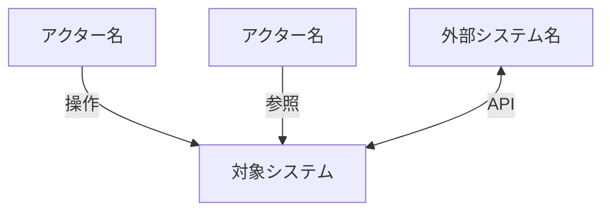
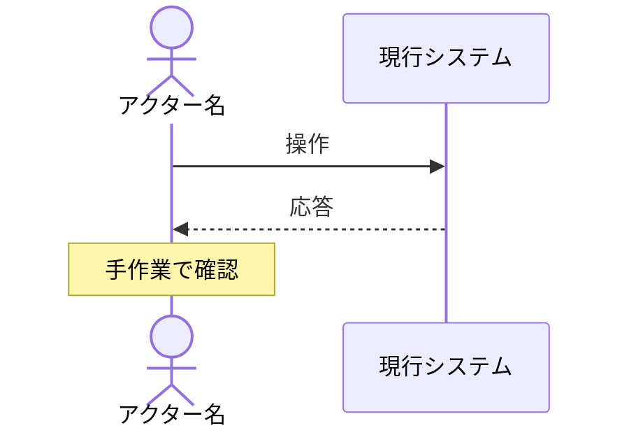

# RDRA（Relationship Driven Requirement Analysis）

RDRA 3.0 に基づき、要求を4レイヤーで構造化する。仕様（How）の上流にある「なぜこのシステムを作るのか」（Why）を明確にするためのスキル。

関連: `artifacts.md`（成果物の耐久性）、`plan-mode.md`（Phase 1 で RDRA の要否を判定）、`ears-reference.md`（EARS パターン詳細）、`/domain-modeling`（情報・状態の詳細な型設計）、`/adr`（重要な判断の記録）

---

## When to Use

- `/rdra` コマンドを実行
- 新規システム・大規模新機能の開発開始時
- plan-mode Phase 1 で「上流分析が必要」と判定された場合
- 「誰のための機能か」「なぜ必要か」が曖昧な場合
- 既存システムの要求を構造化したい場合（チーム統合、引き継ぎ、大規模改修の前提理解）

## When NOT to Use

- バグ修正・リファクタリング・小規模改修（コードとテストが仕様）
- 既存 RDRA 成果物で十分カバーされている場合

---

## 4レイヤー構造

| レイヤー | 問い | 成果物 |
|---------|------|--------|
| **システム価値** | 誰のために、なぜ作るか | アクター一覧、外部システム一覧、ゴール一覧 |
| **外部環境** | どんな業務の中で使われるか | BUC 一覧、業務フロー（as-is / to-be） |
| **システム境界** | 何ができるか | UC 一覧、画面・イベント一覧、要件一覧（EARS） |
| **システム** | どう振る舞うか | 情報（概念リスト）、状態（概念リスト） |

横断: **ビジネスルール一覧**（条件・バリエーションの一元管理）

---

## 段階的詳細化（3フェーズ）

RDRA は一度に完成させるのではなく、3フェーズで段階的に精度を上げる。

```
Phase 1: ビジネスの外枠を固める（方向性の合意）
  Step 1: コンテキスト把握
  Step 2: ゴール定義

Phase 2: ビジネスの組み立て（業務の詳細化）
  Step 3: 業務フロー（BUC → アクティビティ）
  Step 4: 情報・状態の概念リスト

Phase 3: システム化検討（要件の構造化と仕様化）
  Step 5: UC 導出 + 画面・イベントの紐付け
  Step 6: 要件定義（EARS）+ ビジネスルール一覧
  Step 7: トレーサビリティ検証
  Step 8: 保存
```

---

## Phase 1: ビジネスの外枠を固める

### 分析目的の確認

Phase 1 の最初に、RDRA の目的を `AskUserQuestion` で確認する。目的によってスコープと深さが変わる。

| 目的 | スコープへの影響 |
|------|----------------|
| 既存業務の構造化・文書化 | as-is 全体の網羅性重視。to-be は課題仮説レベル |
| 新機能の上流分析 | 関連する BUC・UC に絞り、to-be を詳細化 |
| リファクタ・移行の前提把握 | 実装場所・BR の散在状況を重点的に記録 |

### Step 1: コンテキスト把握

プロジェクトの背景情報を収集し、アクター・外部システム・スコープを特定する。

#### モード判定

対象が新規システムか既存システムかで情報収集の起点が異なる。

| モード | 判定基準 | 情報収集の起点 |
|--------|---------|--------------|
| **新規** | コードベースが存在しない、または参照できない | 企画書・PRD・wiki（トップダウン） |
| **既存** | 動作するコードベースが存在する | コード・DB スキーマ・API（ボトムアップ） + ドキュメント |

#### 情報収集（新規システム）

- インセプションデッキ、PRD、企画書などの既存ドキュメントを読む
- 社内 wiki（Confluence、Notion）があればエージェントで検索
- 関連するアクターや外部システムの仮説を立てる

#### 情報収集（既存システム）

コードベースから RDRA 成果物の草案を自動生成し、それを叩き台に人間と詰める。

**調査ツールの使い分け**: `code-search.md` の判断フローに従う。RDRA の各 Step で最適なツールが異なる。

| Step | 主な調査目的 | 推奨ツール | 理由 |
|------|-------------|-----------|------|
| Step 0 | 関連リポジトリ・ファイルの発見 | Grep + grepai | キーワード検索で広く探し、セマンティック検索で概念的に関連するコードも発見する |
| Step A | シンボル構造・定数・型定義の抽出 | **Serena** (`find_symbol`, `get_symbols_overview`) | シンボル名が判明している構造情報の正確な抽出。enum / const / status の定義と参照箇所 |
| Step A | DB スキーマの把握 | tbls / マイグレーションファイル | テーブル構造・リレーションの全体像 |
| Step B | 業務概念・ビジネスロジックの発見 | **grepai** `search` | 「認証フロー」「手配ロジック」等の概念ベース検索。コードに業務文脈の手がかりがある場合に有効 |
| Step B | シンボル間の依存関係の追跡 | **Serena** (`find_referencing_symbols`) | UseCase → Service → Repository の呼び出しチェーンを構造的に追跡 |

> grepai は英語クエリで検索する（embedding モデルの精度が英語で最も高い）。使用前に `grepai status` で状態を確認し、未初期化なら `grepai init` を提案する。

**Step 0: 関連リポジトリの特定**

RDRA のテーマに関わるコードが複数リポジトリに分散している可能性がある。1つのリポジトリだけ見て業務全体を理解したと思わないこと。

1. **ドメインキーワードの抽出**
   RDRA テーマから業務用語・技術用語を抽出する。日本語・英語・ローマ字表記それぞれ複数バリエーションを含める。
2. **全 working directories の横断検索**
   - **Grep**: 現在の working directories に対してキーワードで検索する。ヒットしたリポジトリをリストアップし、ヒット数と主要ファイルを記録する。レガシーシステムのリポジトリも意識して確認すること。
   - **grepai**（利用可能な場合）: キーワード Grep で見つからない概念的に関連するコードを発見する。例: `grepai search "photographer scheduling algorithm"` で「手配」という文字列を含まないが手配ロジックに関連するコードを検出する。
3. **リポジトリ横断マップの作成**
   ヒットしたリポジトリの役割（API / フロントエンド / レガシー / バッチ / DB 定義等）を整理する。
4. **不足リポジトリの確認**
   `AskUserQuestion` で「他に関連するリポジトリはありますか？」と確認する。ユーザーが追加すべきリポジトリを挙げた場合、`/add-directory` で working directory に追加するよう促す。追加後、新しいリポジトリに対してキーワード検索を実行する。

**Step A: 構造情報の抽出**（精度が高い — レビュー負荷: 低）

DB スキーマとコードのシンボル構造から、情報モデル（INFO）と状態モデル（STATE）の草案を生成する。

```bash
# DB スキーマから情報モデル（INFO）の草案を生成
tbls out <DSN> -t mermaid   # または既存の .tbls.yml / マイグレーションファイル
```

**Serena によるシンボル構造の抽出:**

1. `get_symbols_overview` で対象ディレクトリのシンボル一覧を取得し、主要なクラス・関数を把握する
2. `find_symbol` で status / state / type 系の定数・enum を検索し、STATE 草案を生成する
3. `find_referencing_symbols` で主要シンボル（UseCase, Service 等）の呼び出し関係を追跡し、UC 間の依存構造を把握する

```
例: Serena による調査フロー
1. get_symbols_overview("app/UseCases/") → UseCase 一覧を把握
2. find_symbol("STATUS_") → ステータス定数を全件検索
3. find_referencing_symbols("AssignPhotographersUseCase") → 呼び出し元（Controller）と呼び出し先（Service, Repository）を追跡
```

- テーブル定義・型定義 → 情報（概念リスト）の草案
- enum・状態遷移コード → 状態（概念リスト）の草案
- API エンドポイント・画面ルート → UC 一覧・画面/イベント一覧の草案

**Step B: 業務ドキュメントの収集と照合**（精度が低い — レビュー負荷: **高**）

Step A はコードから機能を抽出するが、**コードに存在する機能が業務で使われているとは限らない**。レガシーと新システムが共存する環境では特に、新機能が開発済みでも現場に浸透していないケースが多い。Step B では業務の実態を把握し、Step A の成果物を検証する。

**B-1. 業務ドキュメントの収集**（Step A より前に着手してもよい）

`AskUserQuestion` で以下を確認する:

- 業務チームのオンボーディング資料・業務マニュアルはあるか（Google Slides / Docs / Notion / Confluence 等）
- 業務フローの手順書・チェックリストはあるか
- 社内 wiki、Slack チャンネル、研修動画等はあるか

> **なぜ最初に聞くのか**: 業務マニュアルには「現場が実際にどのシステムのどの画面を使っているか」が書かれている。コードを読む前にこれを把握することで、調査対象の優先度を正しく設定できる。逆にコードから入ると、使われていない機能の調査に時間を浪費するリスクがある。

入手できた資料はブラウザツール（Claude in Chrome 等）で内容を確認し、以下を抽出する:
- 業務で実際に使われているシステム・画面・URL
- 業務の手順と判断基準（コードに書かれていないビジネスルール）
- 登場するアクター・ロール（コードの権限定義に現れないものを含む）
- システム外で使われているツール（Google Spreadsheet、外部サービス等）

**B-2. コード成果物と業務実態の照合**

Step A で抽出した UC 候補リストを、B-1 の業務ドキュメントと突き合わせて利用状況を分類する。

| 分類 | 説明 | RDRA での扱い |
|------|------|--------------|
| **実利用** | 業務ドキュメントに手順が記載されている | UC として採用。実装場所を正確に記録 |
| **未使用（デッドコード疑い）** | コードは存在するが業務ドキュメントに言及なし | UC 一覧に「未使用」と注記。RDRA のスコープからは除外するが、存在は記録する |
| **手作業（システム外）** | 業務ドキュメントに手順があるがシステム化されていない | アクティビティ一覧に「手作業」として記録。将来のシステム化候補 |
| **ドキュメント未記載** | コードにも業務ドキュメントにもないが、ユーザーの暗黙知として存在 | `AskUserQuestion` で確認 |

> **新旧システム共存時の注意**: レガシーと新システムで同等の機能が存在する場合、**どちらが実際に使われているか**を必ずユーザーに確認する。「新システムが存在する = 移行完了」ではない。マニュアルが参照しているシステム URL は強力な手がかりになる。

**B-3. ビジネスロジックの深掘り**

B-1, B-2 で業務の全体像が見えた後、コードレベルの詳細調査に入る:

- **grepai** でビジネスロジックの散在箇所を発見する。例: `grepai search "business rule validation"`, `grepai search "permission authorization check"`。Grep のキーワード検索では見つからない、概念的に関連するコードを検出できる
- **Serena** `find_referencing_symbols` で UseCase → Service → Repository の呼び出しチェーンを追跡し、ビジネスロジックの実装場所を正確に特定する。grepai で発見したシンボルの依存関係を構造的に辿る
- コードのコメント・テスト名・コミットメッセージから業務意図を読み取る
- **ここは人間の暗黙知が不可欠**。草案を提示して `AskUserQuestion` で修正を求める

**精度の期待値**（既存システムモード）:

| RDRA レイヤー | コードからの自動生成精度 | レビュー集中度 |
|-------------|----------------------|--------------|
| 情報モデル（INFO） | **高** — DB スキーマ・型定義から導出 | 低（名前・説明の修正程度） |
| 状態モデル（STATE） | **高** — enum・状態遷移コードから導出 | 低〜中 |
| UC 一覧 | **中** — API エンドポイント・画面から推測 | **高**（実利用/未使用の判定が必要） |
| BUC・業務フロー | **低** — コードに業務文脈は書かれていない | **高**（人間の暗黙知が必須） |
| アクター・ゴール | **低** — コードからは推測困難 | **高** |

> **「コードが存在する ≠ 業務で使われている」** — UC 一覧のレビュー集中度を「中」から「高」に引き上げた理由。コードから抽出した UC は実利用の裏付けがない限り仮説に過ぎない。業務ドキュメントとの照合（B-2）がこの精度を補う。

> 既存システムモードでは、**業務ドキュメント → DB スキーマ → コード構造**の順で情報の信頼度が高い。業務ドキュメントが「何が使われているか」を示し、DB スキーマが「何が存在するか」を示し、コード構造は「どう実装されているか」を示す。この3層を突き合わせることで、実態に即した RDRA 成果物が作れる。

#### 出力: アクター・外部システム一覧

```markdown
### アクター一覧

| ID | アクター | 種別 | 立場 | 説明 |
|----|---------|------|------|------|
| ACTOR-001 | ... | 内部 | 受益者 | ... |
| ACTOR-002 | ... | 外部 | 提供者 | ... |

### 外部システム一覧

| ID | システム名 | 説明 | 連携方式 |
|----|-----------|------|---------|
| EXT-001 | ... | ... | API / イベント / ファイル |
```

#### 出力: コンテキスト図

アクター・外部システムとシステムの関係を Mermaid で図示する。



`AskUserQuestion` でレビューを依頼する。「このアクター以外に関わるチーム・システムはありませんか？」

> エージェントの仮説は完璧でなくてよい。仮説があることで対話が始まり、暗黙知が引き出される。

---

### Step 2: ゴール定義

各アクターのゴール（事業目標）を定義する。

#### 出力: ゴール一覧

```markdown
### ゴール一覧

| ID | ゴール | 主なステークホルダー |
|----|--------|---------------------|
| GOAL-001 | ... | ACTOR-xxx, ACTOR-yyy |
```

#### チェック

- すべてのアクターが少なくとも1つのゴールに関連しているか
- ゴールが「手段」ではなく「目的」で書かれているか（「API を作る」は手段、「手作業を削減する」は目的）

---

## Phase 2: ビジネスの組み立て

### Step 3: 業務フロー（BUC → アクティビティ）

ゴールに関連するビジネスユースケース（BUC）を洗い出し、業務フローを作成する。

BUC は**外部環境レイヤー**に属する。「ビジネスとしての価値提供の単位」であり、システムを使わない手作業も含む。

#### 出力: BUC 一覧

```markdown
### BUC（ビジネスユースケース）一覧

| ID | ユースケース名 | 受益者 | 提供者 | 内容 | 関連ゴール |
|----|---------------|--------|--------|------|-----------|
| BUC-001 | ... | ACTOR-xxx | ACTOR-yyy | ... | GOAL-xxx |
```

- **受益者**: この BUC で価値を受け取るアクター
- **提供者**: この BUC で価値を提供するアクター（複数可）

#### 出力: アクティビティ一覧

BUC 内の業務を構成するアクティビティを洗い出す。各アクティビティが「システム化される（→ UC になる）」か「手作業のまま」かを明示する。

```markdown
### アクティビティ一覧

| BUC | アクティビティ | 実行者 | システム化 | 備考 |
|-----|---------------|--------|-----------|------|
| BUC-001 | 申込書を受領する | ACTOR-001 | 手作業 | メール添付で受領 |
| BUC-001 | 契約内容を登録する | ACTOR-002 | → UC-001 | |
| BUC-001 | 契約書を送付する | ACTOR-002 | → UC-002 | PDF 生成 + メール送信 |
```

> アクティビティに個別 ID は振らない。BUC + アクティビティ名で一意に識別する。Step 5 でシステム化対象を UC に昇格させる際の入力になる。

#### 出力: 業務フロー（as-is / to-be）

各 BUC の業務フローを Mermaid で作成する。アクターのレーンと「システムを使う箇所」を明示する。

```markdown
### 業務フロー: [BUC 名]

#### as-is



#### 課題仮説
- [現状の業務フローの問題点]
```

#### to-be（改善案）

to-be 候補を複数提示し、各候補がどのゴールを満たすか紐づける。`AskUserQuestion` でユーザーに選択を仰ぐ。

> エージェントが to-be 候補を生成している間、人間は別のドキュメントを読むか、チーム内で議論を再開できる。人間とエージェントが非同期に仮説を検証し合うリズムを活用する。

> **ADR 発火ポイント**: 複数の to-be 候補を比較して選択した場合、`/adr` での記録を提案する。「なぜこの業務フローを選んだか」はコードに残らない判断であり、ADR で残す価値が高い。

---

### Step 4: 情報・状態の概念リスト

業務フローで登場するビジネス上の概念（情報）と、その状態遷移を洗い出す。

**RDRA での役割**: UC がどの情報を操作し、どの状態を遷移させるかを確認する整合性チェックのハブ。

**domain-modeling との分担**: RDRA は「何が存在するか」の発見（概念リスト）。型設計・Aggregate 境界・Policy 設計などの「どう構造化するか」は `/domain-modeling` に委譲する。

#### 出力: 情報（概念リスト）

```markdown
### 情報（概念リスト）

| ID | 概念名 | 説明 | 関連 BUC |
|----|--------|------|---------|
| INFO-001 | 契約 | 顧客との契約 | BUC-001, BUC-003 |
| INFO-002 | ユーザー | システム利用者 | BUC-002 |
```

#### 出力: 状態（概念リスト）

```markdown
### 状態（概念リスト）

| ID | 対象 | 状態遷移（概要） | 関連 BUC |
|----|------|-----------------|---------|
| STATE-001 | 契約 | 申込 → 有効 → 解約 | BUC-001, BUC-005 |
```

#### 出力: コンテキストマップ（暫定）

情報・状態の洗い出し後、明らかに関連の強い概念をグルーピングする。domain-modeling の Bounded Context 発見の**叩き台**であり、確定ではない。

```markdown
### コンテキストマップ（暫定）

| コンテキスト名 | 含まれる情報 | 含まれる状態 | 関連 BUC | 備考 |
|---------------|-------------|-------------|---------|------|
| 契約管理 | INFO-001 契約, INFO-003 プラン | STATE-001 契約 | BUC-001, BUC-005 | |
| ユーザー管理 | INFO-002 ユーザー | STATE-002 アカウント | BUC-002 | 認証基盤と密結合の可能性 |
```

- この段階では「一緒に変更されそうな概念」を同じコンテキストにまとめる程度でよい
- 判断に迷う概念は無理にグルーピングせず、備考に「境界未確定」と記載する
- コンテキスト間の関係（依存方向、共有概念）は `/domain-modeling` で詳細化する

> **domain-modeling への橋渡し**: ここで洗い出した INFO / STATE / コンテキストマップに以下の兆候がある場合、`/domain-modeling` スキルの参照を提案する:
> - 同じ概念名がアクターごとに異なる意味を持つ（コンテキスト境界の兆候）
> - 状態遷移が複雑で、状態ごとに可能な操作が異なる（状態型分離の兆候）
> - 情報の概念数が多く、関係が複雑（Aggregate 境界の判断が必要）
> - コンテキストマップのグルーピングに自信が持てない（境界設計の判断が必要）

---

## Phase 3: システム化検討

### Step 5: UC 導出 + 画面・イベントの紐付け

BUC のアクティビティのうち、**システムが担う部分**を UC（ユースケース）として切り出す。

UC は**システム境界レイヤー**に属する。人との接点（画面）と外部システムとの接点（イベント・タイマー）を明示する。

#### UC の命名規約

UC 名は **「〈対象〉を〈動作〉する」** の形式で統一する。操作対象（情報）と操作（動詞）を明示することで、UC の粒度と責務が一目でわかる。

```
GOOD: 「蔵書の貸出を登録する」「利用者を検索する」「契約を解約する」
BAD:  「貸出処理」「ユーザー管理」「契約関連」（対象・動作が曖昧）
```

#### 出力: UC 一覧

既存システムモードでは `実装場所` と `利用状況` 列を追加する。コードに存在する機能が実際に使われているかを Step B-2 の照合結果に基づいて記録する。

```markdown
### UC（ユースケース）一覧

| ID | ユースケース名 | 主なアクター | 実装場所 | 利用状況 | 関連 BUC | 操作する情報 | 遷移する状態 |
|----|---------------|-------------|---------|---------|---------|-------------|-------------|
| UC-001 | ... | ACTOR-xxx | リポジトリ名 (クラス名) | 実利用 | BUC-xxx | INFO-xxx | STATE-xxx |
| UC-002 | ... | ACTOR-xxx | リポジトリ名 (クラス名) | 未使用 | - | INFO-xxx | STATE-xxx |
```

**利用状況の凡例:**
- **実利用**: 業務ドキュメント/ユーザー確認で利用が裏付けられている
- **未使用**: コードは存在するが業務で使われていない（デッドコード疑い）
- **限定利用**: 特定の場面・時期でのみ使用（例: 繁忙期のみ）
- **不明**: 利用状況が確認できていない

#### 出力: 画面・イベント・タイマー一覧

```markdown
### 画面・イベント・タイマー一覧

| ID | 名称 | 種別 | 関連 UC | 説明 |
|----|------|------|---------|------|
| SCR-001 | ユーザー登録画面 | 画面 | UC-001 | → /screen-spec で詳細化 |
| EVT-001 | 契約作成 API | イベント | UC-003 | 外部システム EXT-001 から受信 |
| TMR-001 | 月末締め処理 | タイマー | UC-010 | 毎月末日 23:00 に実行 |
```

**種別:**
- **画面**: アクターとシステムの接点（UI）
- **イベント**: 外部システムとの接点（API 受信、Webhook 等）
- **タイマー**: 業務上の時間境界（月末締め、25日締め、年次処理等）。バッチ処理やスケジュール駆動の UC を見落とさないために明示する

> 画面の詳細仕様は `/screen-spec` スキルに委譲する。ここでは「何が存在するか」の一覧のみ。

---

### Step 6: 要件定義（EARS）+ ビジネスルール一覧

#### 要件一覧（EARS）

UC から、システムが満たすべき要件を EARS パターンで定義する。詳細は `ears-reference.md` を参照。

```markdown
### 要件一覧

| ID | 要件（EARS） | パターン | 関連 UC | 関連ルール |
|----|-------------|---------|---------|-----------|
| REQ-001 | [トリガー] のとき、システムは [応答] しなければならない | イベント駆動型 | UC-xxx | BR-xxx |
| REQ-002 | [望まない状態] の場合、システムは [応答] しなければならない | 異常系 | UC-xxx | BR-xxx |
```

#### ビジネスルール一覧

業務上の条件・バリエーションを**一元管理**する独立セクション。EARS 要件や UC から参照される。

```markdown
### ビジネスルール一覧

| ID | ルール名 | 種別 | 内容 | 参照元 UC | 実装状況 |
|----|---------|------|------|----------|---------|
| BR-001 | 契約期間制約 | 条件 | 契約開始日は申込日の翌月1日以降 | UC-003 | 全システム |
| BR-002 | プラン別上限 | バリエーション | Basic: 10件, Pro: 100件, Enterprise: 無制限 | UC-005, UC-012 | 新システムのみ |
```

**ルールの種別:**
- **条件**: 業務上の制約・判定ルール（〜の場合のみ許可、〜は禁止）
- **バリエーション**: 同じ操作の分岐パターン（プラン別、ロール別、契約種別等）

> ビジネスルールは EARS 要件に分散させず、この一覧で集約管理する。EARS 要件からは `BR-xxx` で参照する。これにより、ルール変更時の影響範囲を一覧から即座に特定できる。

> **domain-modeling への橋渡し**: ビジネスルール（BR）は、domain-modeling で Policy / Specification としてコード化される。RDRA は「ルールの発見と集約」、domain-modeling は「ルールの構造化と実装設計」。

---

### Step 7: トレーサビリティ検証

全要素の依存チェーンが途切れていないことを検証する。

#### Why の依存チェーン

```
GOAL ← REQ ← UC ← BUC ← アクター
              ↑
          ビジネスルール（BR）
```

#### 検証項目

- [ ] すべての REQ が少なくとも1つの UC に紐づいているか
- [ ] すべての UC が少なくとも1つの BUC に紐づいているか
- [ ] すべての BUC が少なくとも1つの GOAL に紐づいているか
- [ ] すべての GOAL に少なくとも1つの BUC が紐づいているか（未実現ゴールの検出）
- [ ] アクター全員が BUC に登場しているか
- [ ] UC が操作する INFO / STATE が概念リストに存在するか
- [ ] ビジネスルール（BR）が少なくとも1つの UC から参照されているか（孤立ルールの検出）

孤立要素がある場合はユーザーに報告し、削除するか要素を追加するか確認する。

---

### Step 8: 成果物の保存

RDRA 成果物はプロジェクトの `docs/rdra/` に保存する。RDRA 成果物は**永続的**に管理する（`artifacts.md` 参照）。

#### ディレクトリ構造

```
docs/rdra/
├── overview.md           # 全レイヤーの構造化テーブル + トレーサビリティ
└── flows/                # 業務フロー（as-is / to-be）
    ├── {業務名}.md
    └── ...
```

> RDRA 分析中の重要な判断（アクター分割の理由、to-be 選択の根拠等）は `docs/adr/` に ADR として記録する。

> 規模が大きくなり overview.md が肥大化したら、インデックス + 詳細ページに分離する（`usecases/UC-001.md` 等）。最初から分割する必要はない。

> 画面の詳細仕様（`/screen-spec`）は RDRA 中に作成する必要はない。ここでは画面・イベントの一覧（SCR-xxx, EVT-xxx）を特定するのみ。詳細仕様は実装フェーズで必要になった時点で作成する。

### 次のステップ

RDRA 完了後、実装に進むには plan-mode（`EnterPlanMode`）に入る。RDRA の GOAL / REQ / UC を参照しながら、plan-mode Phase 1 でスコープを定義し、Phase 3 でタスクの受入条件（GWT）を EARS 要件から導出する。

#### overview.md の構成

```markdown
# RDRA Overview: [プロジェクト名]

## コンテキスト図
（Step 1 の Mermaid 図）

## システム価値
### アクター一覧
### 外部システム一覧
### ゴール一覧

## 外部環境
### BUC（ビジネスユースケース）一覧
### アクティビティ一覧
### 業務フロー → flows/ を参照

## システム境界
### リポジトリ横断マップ
### UC（ユースケース）一覧
### 画面・イベント・タイマー一覧

## システム
### 情報（概念リスト）
### 状態（概念リスト）
### コンテキストマップ（暫定）

## ビジネスルール一覧

## 要件一覧（EARS）

## トレーサビリティ
```

---

## 更新時のフロー

既存 RDRA に対して要件追加・変更がある場合:

1. 変更対象の要素（REQ, UC, BUC 等）を特定
2. 依存チェーンを辿り、影響範囲を特定（UC 変更 → REQ への影響、BUC への影響）
3. ビジネスルール（BR）に変更がある場合、参照元 UC への影響を確認
4. 変更を適用し、トレーサビリティを再検証（Step 7）
5. 変更理由が重要な判断を伴う場合は `/adr` で記録

---

## plan-mode との連携

RDRA 完了後、plan-mode に入る際:

- Phase 1: RDRA の GOAL と REQ を参照し、スコープを定義
- Phase 3: タスク受入条件（GWT）を RDRA の REQ（EARS）から導出
- Phase 3: タスク定義に `関連要件: REQ-xxx` を追記し、トレーサビリティを維持

### EARS → GWT の導出

1つの EARS 要件から、正常系・異常系・境界値の GWT を導出する。

```
REQ-001 (EARS):
  ユーザーが有効なデータで登録フォームを送信したとき、
  システムはユーザーアカウントを作成し、認証メールを送信しなければならない。

  ↓ 導出される GWT（計画のタスク受入条件）

  正常系: GIVEN 有効なデータ WHEN 送信 THEN アカウント作成 + メール送信
  異常系: GIVEN 重複メール WHEN 送信 THEN 409 エラー
  境界値: GIVEN パスワード8文字ちょうど WHEN 送信 THEN 成功
```

詳細は `ears-reference.md` の「EARS → GWT への導出」セクションを参照。

## domain-modeling との連携

RDRA は「何が存在するか」の発見、domain-modeling は「どう構造化するか」の設計。

| RDRA の成果物 | domain-modeling の入力 |
|-------------|----------------------|
| 情報（概念リスト） | Entity / Value Object の設計 |
| 状態（概念リスト） | 状態型分離（Discriminated Union） |
| ビジネスルール（BR） | Policy / Specification の抽出 |
| コンテキスト図 + アクター | Bounded Context の発見 |
| コンテキストマップ（暫定） | Bounded Context の境界確定・依存方向の設計 |
| UC 一覧 | Aggregate の操作（コマンド） |
