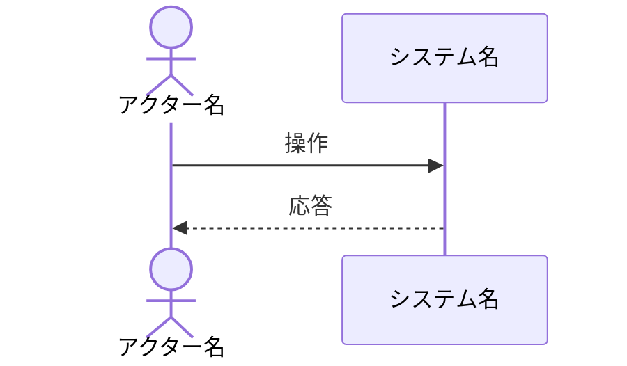

# RDRA（Relationship Driven Requirement Analysis）

RDRA 3.0 に基づき、要求を4レイヤーで構造化する。仕様（How）の上流にある「なぜこのシステムを作るのか」（Why）を明確にするためのスキル。

関連: `artifacts.md`（成果物の耐久性）、`plan-mode.md`（Phase 1 で RDRA の要否を判定）、`ears-reference.md`（EARS パターン詳細）

---

## When to Use

- `/rdra` コマンドを実行
- 新規システム・大規模新機能の開発開始時
- plan-mode Phase 1 で「上流分析が必要」と判定された場合
- 「誰のための機能か」「なぜ必要か」が曖昧な場合

## When NOT to Use

- バグ修正・リファクタリング・小規模改修（コードとテストが仕様）
- 既存 RDRA 成果物で十分カバーされている場合

---

## 4レイヤー構造

| レイヤー | 問い | 成果物 |
|---------|------|--------|
| **システム価値** | 誰のために、なぜ作るか | アクター一覧、ゴール一覧 |
| **外部環境** | どんな業務の中で使われるか | 業務フロー（as-is / to-be） |
| **システム境界** | 何ができるか | ビジネスユースケース一覧、要件一覧（EARS） |
| **システム** | どう振る舞うか | 概要のみ。詳細は `/screen-spec` や Contract に委譲 |

---

## Step 1: スコープ把握

プロジェクトの背景情報を収集し、分析対象のスコープを特定する。

### 情報収集

- インセプションデッキ、PRD、企画書などの既存ドキュメントを読む
- 社内 wiki（Confluence、Notion）があればエージェントで検索
- 関連するアクターや外部システムの仮説を立てる

### 出力: アクター仮説

```markdown
### アクター一覧（仮説）

| ID | アクター | 種別 | 説明 |
|----|---------|------|------|
| ACTOR-001 | ... | human | ... |
| ACTOR-002 | ... | system | ... |
```

`AskUserQuestion` でレビューを依頼する。「このアクター以外に関わるチーム・システムはありませんか？」

> エージェントの仮説は完璧でなくてよい。仮説があることで対話が始まり、暗黙知が引き出される。

---

## Step 2: システム価値（ゴール定義）

各アクターのゴール（事業目標）を定義する。

### 出力: ゴール一覧

```markdown
### ゴール一覧

| ID | ゴール | 主なステークホルダー |
|----|--------|---------------------|
| GOAL-001 | ... | ACTOR-xxx, ACTOR-yyy |
```

### チェック

- すべてのアクターが少なくとも1つのゴールに関連しているか
- ゴールが「手段」ではなく「目的」で書かれているか（「API を作る」は手段、「手作業を削減する」は目的）

---

## Step 3: 外部環境（業務フロー）

ゴールに関連する業務フローを Mermaid シーケンス図で作成する。

### as-is（現状）

現在の業務フローを図示し、課題仮説を添える。

```markdown
### 業務フロー: [名前]

#### as-is



#### 課題仮説
- [現状の業務フローの問題点]
```

### to-be（改善案）

to-be 候補を複数提示し、各候補がどのゴールを満たすか紐づける。`AskUserQuestion` でユーザーに選択を仰ぐ。

> エージェントが to-be 候補を生成している間、人間は別のドキュメントを読むか、チーム内で議論を再開できる。人間とエージェントが非同期に仮説を検証し合うリズムを活用する。

> **ADR 発火ポイント**: 複数の to-be 候補を比較して選択した場合、`/adr` での記録を提案する。「なぜこの業務フローを選んだか」はコードに残らない判断であり、ADR で残す価値が高い。

---

## Step 4: システム境界（要件定義）

業務フロー（to-be）から、システムが満たすべき要件を EARS パターンで定義する。

### EARS パターン

要件は以下の6パターンで記述する。詳細は `ears-reference.md` を参照。

| パターン | キーワード | 用途 |
|---------|-----------|------|
| Ubiquitous | (なし) | 常時有効な制約 |
| Event-driven | **When** | トリガー起因の動作 |
| State-driven | **While** | 状態中の制約 |
| Optional | **Where** | オプション機能 |
| Unwanted | **If...then** | 異常系 |
| Complex | 複合 | 上記の組み合わせ |

### 出力: 要件一覧

```markdown
### 要件一覧

| ID | 要件（EARS） | パターン | 関連ゴール |
|----|-------------|---------|-----------|
| REQ-001 | When [trigger], the system shall [response] | Event-driven | GOAL-xxx |
| REQ-002 | While [precondition], the system shall [response] | State-driven | GOAL-xxx |
| REQ-003 | If [unwanted condition], then the system shall [response] | Unwanted | GOAL-xxx |
```

### 出力: ビジネスユースケース一覧

```markdown
### ビジネスユースケース一覧

| ID | ユースケース名 | 主なアクター | 内容 | 関連要件 |
|----|---------------|-------------|------|---------|
| BUC-001 | ... | ACTOR-xxx | ... | REQ-xxx |
```

---

## Step 5: トレーサビリティ検証

全要素の依存チェーンが途切れていないことを検証する。

### Why の依存チェーン

```
GOAL ← REQ ← BUC
```

### 検証項目

- [ ] すべての REQ が少なくとも1つの GOAL に紐づいているか（孤立要件ゼロ）
- [ ] すべての BUC が少なくとも1つの REQ に紐づいているか
- [ ] すべての GOAL に少なくとも1つの REQ が紐づいているか（未実現ゴールの検出）
- [ ] アクター全員が BUC に登場しているか

孤立要素がある場合はユーザーに報告し、削除するか要素を追加するか確認する。

---

## Step 6: 成果物の保存

RDRA 成果物はプロジェクトの `docs/rdra/` に保存する。RDRA 成果物は**永続的**に管理する（`artifacts.md` 参照）。

### ディレクトリ構造

```
docs/rdra/
├── overview.md           # アクター・ゴール・要件・BUC の一覧 + 依存関係
└── flows/                # 業務フロー（as-is / to-be）
    ├── {業務名}.md
    └── ...
```

> RDRA 分析中の重要な判断（アクター分割の理由、to-be 選択の根拠等）は `docs/adr/` に ADR として記録する。RDRA 専用の decisions ファイルは持たない（`/adr` スキルに統合）。

### overview.md の構成

```markdown
# RDRA Overview: [プロジェクト名]

## アクター一覧
（Step 1 の出力）

## ゴール一覧
（Step 2 の出力）

## 要件一覧
（Step 4 の EARS 要件）

## ビジネスユースケース一覧
（Step 4 の BUC）

## トレーサビリティ
（Step 5 の依存チェーン検証結果）
```

---

## 更新時のフロー

既存 RDRA に対して要件追加・変更がある場合:

1. 変更対象の要素（REQ, BUC 等）を特定
2. 依存チェーンを辿り、影響範囲を特定（REQ 変更 → BUC への影響、GOAL への影響）
3. 変更を適用し、トレーサビリティを再検証（Step 5）
4. 変更理由が重要な判断を伴う場合は `/adr` で記録

---

## plan-mode との連携

RDRA 完了後、plan-mode に入る際:

- Phase 1: RDRA の GOAL と REQ を参照し、スコープを定義
- Phase 3: タスク受入条件（GWT）を RDRA の REQ（EARS）から導出
- Phase 3: タスク定義に `関連要件: REQ-xxx` を追記し、トレーサビリティを維持

### EARS → GWT の導出

1つの EARS 要件から、正常系・異常系・境界値の GWT を導出する。

```
REQ-001 (EARS):
  When the user submits the registration form with valid data,
  the system shall create the user account and send a verification email.

  ↓ 導出される GWT（計画のタスク受入条件）

  正常系: GIVEN 有効なデータ WHEN 送信 THEN アカウント作成 + メール送信
  異常系: GIVEN 重複メール WHEN 送信 THEN 409 エラー
  境界値: GIVEN パスワード8文字ちょうど WHEN 送信 THEN 成功
```

詳細は `ears-reference.md` の「EARS → GWT への導出」セクションを参照。
