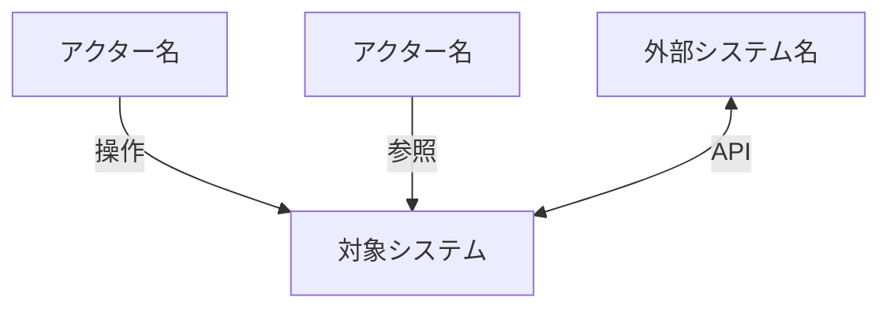
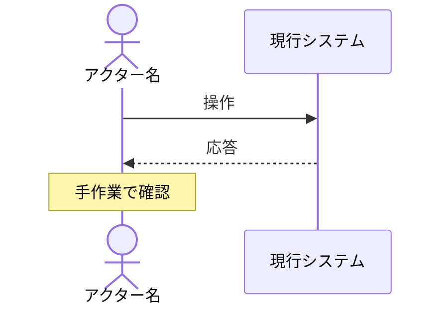

# RDRA（Relationship Driven Requirement Analysis）

RDRA 3.0 に基づき、要求を4レイヤーで構造化する。仕様（How）の上流にある「なぜこのシステムを作るのか」（Why）を明確にするためのスキル。

関連: `artifacts.md`（成果物の耐久性）、`plan-mode.md`（Phase 1 で RDRA の要否を判定）、`ears-reference.md`（EARS パターン詳細）、`/domain-modeling`（情報・状態の詳細な型設計）、`/adr`（重要な判断の記録）

---

## When to Use

- `/rdra` コマンドを実行
- 新規システム・大規模新機能の開発開始時
- plan-mode Phase 1 で「上流分析が必要」と判定された場合
- 「誰のための機能か」「なぜ必要か」が曖昧な場合

## When NOT to Use

- バグ修正・リファクタリング・小規模改修（コードとテストが仕様）
- 既存 RDRA 成果物で十分カバーされている場合

---

## 4レイヤー構造

| レイヤー | 問い | 成果物 |
|---------|------|--------|
| **システム価値** | 誰のために、なぜ作るか | アクター一覧、外部システム一覧、ゴール一覧 |
| **外部環境** | どんな業務の中で使われるか | BUC 一覧、業務フロー（as-is / to-be） |
| **システム境界** | 何ができるか | UC 一覧、画面・イベント一覧、要件一覧（EARS） |
| **システム** | どう振る舞うか | 情報（概念リスト）、状態（概念リスト） |

横断: **ビジネスルール一覧**（条件・バリエーションの一元管理）

---

## 段階的詳細化（3フェーズ）

RDRA は一度に完成させるのではなく、3フェーズで段階的に精度を上げる。

```
Phase 1: ビジネスの外枠を固める（方向性の合意）
  Step 1: コンテキスト把握
  Step 2: ゴール定義

Phase 2: ビジネスの組み立て（業務の詳細化）
  Step 3: 業務フロー（BUC → アクティビティ）
  Step 4: 情報・状態の概念リスト

Phase 3: システム化検討（要件の構造化と仕様化）
  Step 5: UC 導出 + 画面・イベントの紐付け
  Step 6: 要件定義（EARS）+ ビジネスルール一覧
  Step 7: トレーサビリティ検証
  Step 8: 保存
```

---

## Phase 1: ビジネスの外枠を固める

### Step 1: コンテキスト把握

プロジェクトの背景情報を収集し、アクター・外部システム・スコープを特定する。

#### 情報収集

- インセプションデッキ、PRD、企画書などの既存ドキュメントを読む
- 社内 wiki（Confluence、Notion）があればエージェントで検索
- 関連するアクターや外部システムの仮説を立てる

#### 出力: アクター・外部システム一覧

```markdown
### アクター一覧

| ID | アクター | 種別 | 説明 |
|----|---------|------|------|
| ACTOR-001 | ... | human | ... |
| ACTOR-002 | ... | human | ... |

### 外部システム一覧

| ID | システム名 | 説明 | 連携方式 |
|----|-----------|------|---------|
| EXT-001 | ... | ... | API / イベント / ファイル |
```

#### 出力: コンテキスト図

アクター・外部システムとシステムの関係を Mermaid で図示する。



`AskUserQuestion` でレビューを依頼する。「このアクター以外に関わるチーム・システムはありませんか？」

> エージェントの仮説は完璧でなくてよい。仮説があることで対話が始まり、暗黙知が引き出される。

---

### Step 2: ゴール定義

各アクターのゴール（事業目標）を定義する。

#### 出力: ゴール一覧

```markdown
### ゴール一覧

| ID | ゴール | 主なステークホルダー |
|----|--------|---------------------|
| GOAL-001 | ... | ACTOR-xxx, ACTOR-yyy |
```

#### チェック

- すべてのアクターが少なくとも1つのゴールに関連しているか
- ゴールが「手段」ではなく「目的」で書かれているか（「API を作る」は手段、「手作業を削減する」は目的）

---

## Phase 2: ビジネスの組み立て

### Step 3: 業務フロー（BUC → アクティビティ）

ゴールに関連するビジネスユースケース（BUC）を洗い出し、業務フローを作成する。

BUC は**外部環境レイヤー**に属する。「ビジネスとしての価値提供の単位」であり、システムを使わない手作業も含む。

#### 出力: BUC 一覧

```markdown
### BUC（ビジネスユースケース）一覧

| ID | ユースケース名 | 主なアクター | 内容 | 関連ゴール |
|----|---------------|-------------|------|-----------|
| BUC-001 | ... | ACTOR-xxx | ... | GOAL-xxx |
```

#### 出力: 業務フロー（as-is / to-be）

各 BUC の業務フローを Mermaid で作成する。アクターのレーンと「システムを使う箇所」を明示する。

```markdown
### 業務フロー: [BUC 名]

#### as-is



#### 課題仮説
- [現状の業務フローの問題点]
```

#### to-be（改善案）

to-be 候補を複数提示し、各候補がどのゴールを満たすか紐づける。`AskUserQuestion` でユーザーに選択を仰ぐ。

> エージェントが to-be 候補を生成している間、人間は別のドキュメントを読むか、チーム内で議論を再開できる。人間とエージェントが非同期に仮説を検証し合うリズムを活用する。

> **ADR 発火ポイント**: 複数の to-be 候補を比較して選択した場合、`/adr` での記録を提案する。「なぜこの業務フローを選んだか」はコードに残らない判断であり、ADR で残す価値が高い。

---

### Step 4: 情報・状態の概念リスト

業務フローで登場するビジネス上の概念（情報）と、その状態遷移を洗い出す。

**RDRA での役割**: UC がどの情報を操作し、どの状態を遷移させるかを確認する整合性チェックのハブ。

**domain-modeling との分担**: RDRA は「何が存在するか」の発見（概念リスト）。型設計・Aggregate 境界・Policy 設計などの「どう構造化するか」は `/domain-modeling` に委譲する。

#### 出力: 情報（概念リスト）

```markdown
### 情報（概念リスト）

| ID | 概念名 | 説明 | 関連 BUC |
|----|--------|------|---------|
| INFO-001 | 契約 | 顧客との契約 | BUC-001, BUC-003 |
| INFO-002 | ユーザー | システム利用者 | BUC-002 |
```

#### 出力: 状態（概念リスト）

```markdown
### 状態（概念リスト）

| ID | 対象 | 状態遷移（概要） | 関連 BUC |
|----|------|-----------------|---------|
| STATE-001 | 契約 | 申込 → 有効 → 解約 | BUC-001, BUC-005 |
```

> **domain-modeling への橋渡し**: ここで洗い出した INFO / STATE に以下の兆候がある場合、`/domain-modeling` スキルの参照を提案する:
> - 同じ概念名がアクターごとに異なる意味を持つ（コンテキスト境界の兆候）
> - 状態遷移が複雑で、状態ごとに可能な操作が異なる（状態型分離の兆候）
> - 情報の概念数が多く、関係が複雑（Aggregate 境界の判断が必要）

---

## Phase 3: システム化検討

### Step 5: UC 導出 + 画面・イベントの紐付け

BUC のアクティビティのうち、**システムが担う部分**を UC（ユースケース）として切り出す。

UC は**システム境界レイヤー**に属する。人との接点（画面）と外部システムとの接点（イベント）を明示する。

#### 出力: UC 一覧

```markdown
### UC（ユースケース）一覧

| ID | ユースケース名 | 主なアクター | 内容 | 関連 BUC | 操作する情報 | 遷移する状態 |
|----|---------------|-------------|------|---------|-------------|-------------|
| UC-001 | ... | ACTOR-xxx | ... | BUC-xxx | INFO-xxx | STATE-xxx |
```

#### 出力: 画面・イベント一覧

```markdown
### 画面・イベント一覧

| ID | 名称 | 種別 | 関連 UC | 説明 |
|----|------|------|---------|------|
| SCR-001 | ユーザー登録画面 | 画面 | UC-001 | → /screen-spec で詳細化 |
| EVT-001 | 契約作成 API | イベント | UC-003 | 外部システム EXT-001 から受信 |
```

> 画面の詳細仕様は `/screen-spec` スキルに委譲する。ここでは「何が存在するか」の一覧のみ。

---

### Step 6: 要件定義（EARS）+ ビジネスルール一覧

#### 要件一覧（EARS）

UC から、システムが満たすべき要件を EARS パターンで定義する。詳細は `ears-reference.md` を参照。

```markdown
### 要件一覧

| ID | 要件（EARS） | パターン | 関連 UC | 関連ルール |
|----|-------------|---------|---------|-----------|
| REQ-001 | When [trigger], the system shall [response] | Event-driven | UC-xxx | BR-xxx |
| REQ-002 | If [condition], then the system shall [response] | Unwanted | UC-xxx | BR-xxx |
```

#### ビジネスルール一覧

業務上の条件・バリエーションを**一元管理**する独立セクション。EARS 要件や UC から参照される。

```markdown
### ビジネスルール一覧

| ID | ルール名 | 種別 | 内容 | 参照元 UC |
|----|---------|------|------|----------|
| BR-001 | 契約期間制約 | 条件 | 契約開始日は申込日の翌月1日以降 | UC-003 |
| BR-002 | プラン別上限 | バリエーション | Basic: 10件, Pro: 100件, Enterprise: 無制限 | UC-005, UC-012 |
```

**ルールの種別:**
- **条件**: 業務上の制約・判定ルール（〜の場合のみ許可、〜は禁止）
- **バリエーション**: 同じ操作の分岐パターン（プラン別、ロール別、契約種別等）

> ビジネスルールは EARS 要件に分散させず、この一覧で集約管理する。EARS 要件からは `BR-xxx` で参照する。これにより、ルール変更時の影響範囲を一覧から即座に特定できる。

> **domain-modeling への橋渡し**: ビジネスルール（BR）は、domain-modeling で Policy / Specification としてコード化される。RDRA は「ルールの発見と集約」、domain-modeling は「ルールの構造化と実装設計」。

---

### Step 7: トレーサビリティ検証

全要素の依存チェーンが途切れていないことを検証する。

#### Why の依存チェーン

```
GOAL ← REQ ← UC ← BUC ← アクター
              ↑
          ビジネスルール（BR）
```

#### 検証項目

- [ ] すべての REQ が少なくとも1つの UC に紐づいているか
- [ ] すべての UC が少なくとも1つの BUC に紐づいているか
- [ ] すべての BUC が少なくとも1つの GOAL に紐づいているか
- [ ] すべての GOAL に少なくとも1つの BUC が紐づいているか（未実現ゴールの検出）
- [ ] アクター全員が BUC に登場しているか
- [ ] UC が操作する INFO / STATE が概念リストに存在するか
- [ ] ビジネスルール（BR）が少なくとも1つの UC から参照されているか（孤立ルールの検出）

孤立要素がある場合はユーザーに報告し、削除するか要素を追加するか確認する。

---

### Step 8: 成果物の保存

RDRA 成果物はプロジェクトの `docs/rdra/` に保存する。RDRA 成果物は**永続的**に管理する（`artifacts.md` 参照）。

#### ディレクトリ構造

```
docs/rdra/
├── overview.md           # 全レイヤーの構造化テーブル + トレーサビリティ
└── flows/                # 業務フロー（as-is / to-be）
    ├── {業務名}.md
    └── ...
```

> RDRA 分析中の重要な判断（アクター分割の理由、to-be 選択の根拠等）は `docs/adr/` に ADR として記録する。

> 規模が大きくなり overview.md が肥大化したら、インデックス + 詳細ページに分離する（`usecases/UC-001.md` 等）。最初から分割する必要はない。

> 画面の詳細仕様（`/screen-spec`）は RDRA 中に作成する必要はない。ここでは画面・イベントの一覧（SCR-xxx, EVT-xxx）を特定するのみ。詳細仕様は実装フェーズで必要になった時点で作成する。

### 次のステップ

RDRA 完了後、実装に進むには plan-mode（`EnterPlanMode`）に入る。RDRA の GOAL / REQ / UC を参照しながら、plan-mode Phase 1 でスコープを定義し、Phase 3 でタスクの受入条件（GWT）を EARS 要件から導出する。

#### overview.md の構成

```markdown
# RDRA Overview: [プロジェクト名]

## コンテキスト図
（Step 1 の Mermaid 図）

## システム価値
### アクター一覧
### 外部システム一覧
### ゴール一覧

## 外部環境
### BUC（ビジネスユースケース）一覧
### 業務フロー → flows/ を参照

## システム境界
### UC（ユースケース）一覧
### 画面・イベント一覧

## システム
### 情報（概念リスト）
### 状態（概念リスト）

## ビジネスルール一覧

## 要件一覧（EARS）

## トレーサビリティ
```

---

## 更新時のフロー

既存 RDRA に対して要件追加・変更がある場合:

1. 変更対象の要素（REQ, UC, BUC 等）を特定
2. 依存チェーンを辿り、影響範囲を特定（UC 変更 → REQ への影響、BUC への影響）
3. ビジネスルール（BR）に変更がある場合、参照元 UC への影響を確認
4. 変更を適用し、トレーサビリティを再検証（Step 7）
5. 変更理由が重要な判断を伴う場合は `/adr` で記録

---

## plan-mode との連携

RDRA 完了後、plan-mode に入る際:

- Phase 1: RDRA の GOAL と REQ を参照し、スコープを定義
- Phase 3: タスク受入条件（GWT）を RDRA の REQ（EARS）から導出
- Phase 3: タスク定義に `関連要件: REQ-xxx` を追記し、トレーサビリティを維持

### EARS → GWT の導出

1つの EARS 要件から、正常系・異常系・境界値の GWT を導出する。

```
REQ-001 (EARS):
  When the user submits the registration form with valid data,
  the system shall create the user account and send a verification email.

  ↓ 導出される GWT（計画のタスク受入条件）

  正常系: GIVEN 有効なデータ WHEN 送信 THEN アカウント作成 + メール送信
  異常系: GIVEN 重複メール WHEN 送信 THEN 409 エラー
  境界値: GIVEN パスワード8文字ちょうど WHEN 送信 THEN 成功
```

詳細は `ears-reference.md` の「EARS → GWT への導出」セクションを参照。

## domain-modeling との連携

RDRA は「何が存在するか」の発見、domain-modeling は「どう構造化するか」の設計。

| RDRA の成果物 | domain-modeling の入力 |
|-------------|----------------------|
| 情報（概念リスト） | Entity / Value Object の設計 |
| 状態（概念リスト） | 状態型分離（Discriminated Union） |
| ビジネスルール（BR） | Policy / Specification の抽出 |
| コンテキスト図 + アクター | Bounded Context の発見 |
| UC 一覧 | Aggregate の操作（コマンド） |
